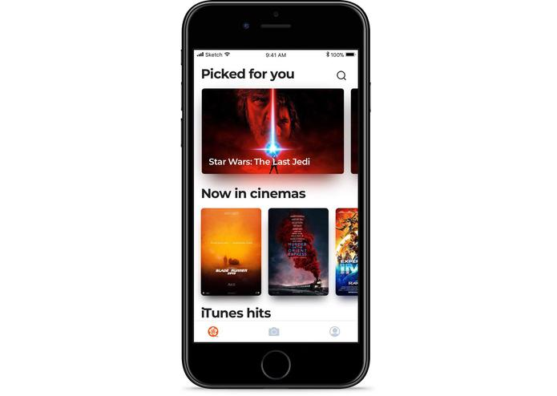
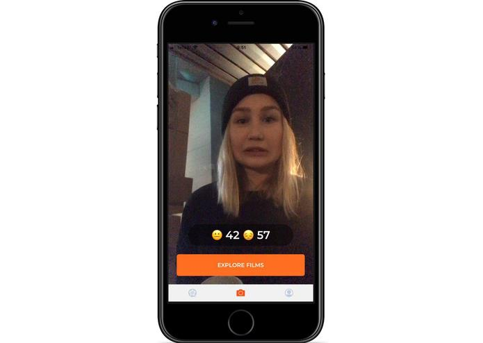
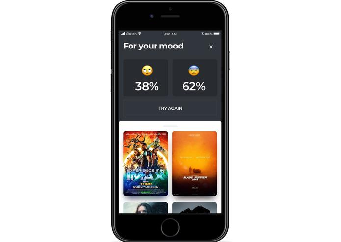
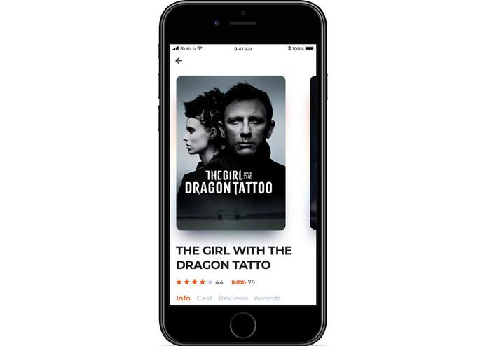
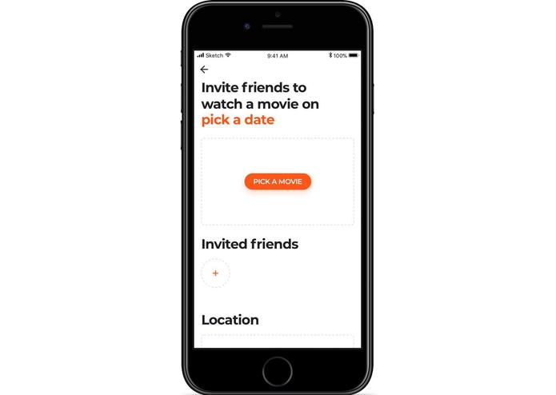
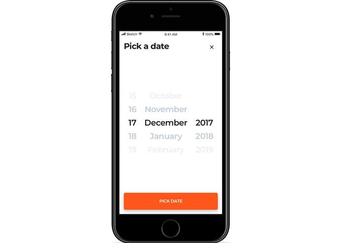
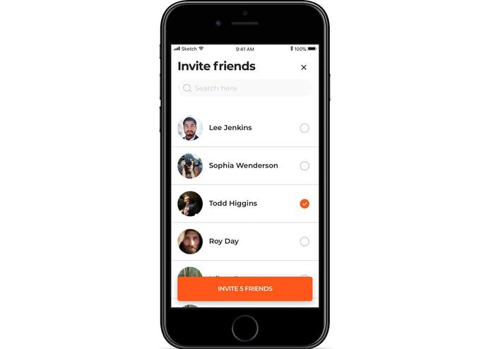
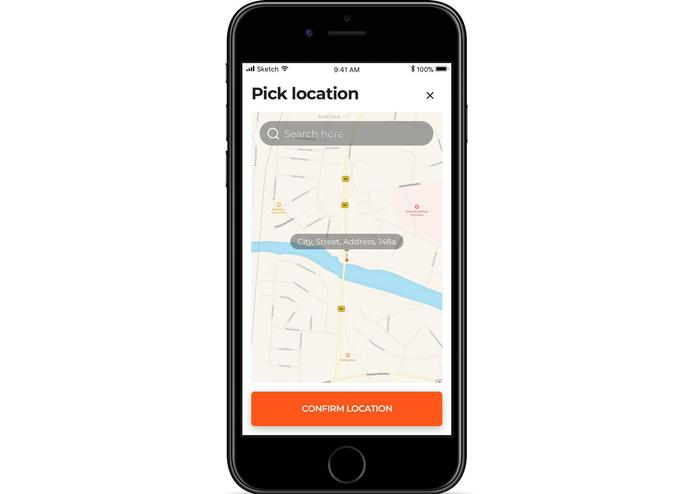
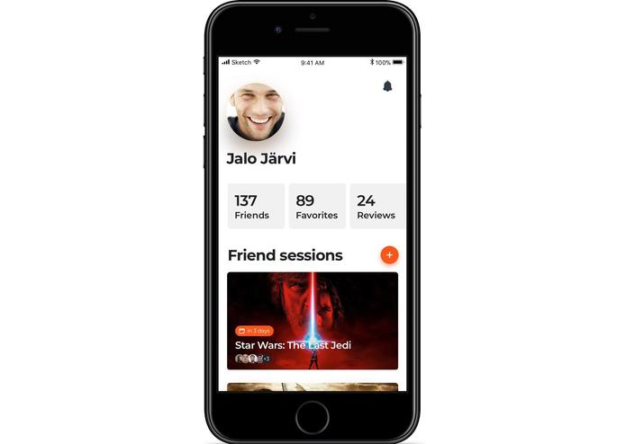

# **Inspiration**

Cinema industry is rapidly growing, video content volume of superior quality is also skyrocketing.

Each user has a higher probability to find a movie that he or she will like. That is absolutely awesome! Our team would like to be on the wave!

However, in terms of user experience, there are some growing drawbacks:

1) More and more criteria (release year, rating, country, cast, etc.) are needed to be choosen not to spend too much time for a movie search;

2) Among growing number of alternatives, it is extremely difficult to make a final choice.

Our team is strongly inspired by user expirience possible improvements while searching a movie to watch: to optimize search path and to improve recommendations quality.

Our team is guided by a principle "Mobile First". That is why, our product is a moble application that is named MONA.

# **What it does**

  <i>Home page</i>

We thought that all three track questions are highly interesting and perspective. So, we made our best to answer to all of them. However, we face with some technical issues, so the last question is not answered by our team,

I will provide all readers with short summary of each of two suggested solutions.

### **How to find movies I like?**

Each user has a certain emotional condition in a process of movie search. Emotional condition is a combination of emotions that has strong impact on movie search results.

  <i>How it works? Emotions detection</i>

We detect two main user’s emotions (among 8 main emotions: anger, contempt, disgust, fear, happiness, neutral, sadness, surprise): through frontal camera and adapt search results to it.

1 emotion symbolazes 1 emodji in the app. Emojis provide a user with exiting interactive experience.

One of the feature is - even few users can take part in emotions detecting process. It is quite fun to detect emotions together – there is mathematic algorithm, summarizing all the emotions.

  <i>Recommendations, based on emotions</i>

The app is a solution of the problem of users’ unknown search criteria – now users are not forced to set any settings. The more data will be collected about users, the more personal relevant recommendation a user will get through MONA app.

  <i>Relevant recommendation</i>

### **How to plan my watching?**

The more people are going to watch a movie, the more difficult task is to choose it – the app makes users’ life easier. Each person has different preferences, however there is an intersection of preferences that maximize value of a movie watch.

  <i>Plan watching with friends</i>

The app allows you to plan your watching with friends:

* common movie list suggestion;
* voting mechanic;
* opportunity to add movie session to calendar.

  <i>Plan watching with friends: pick date</i>

One user suggests to his or her friend a movie session with a certain movie that both friends have in bookmarks. If both friends approve the request there is an opportunity to add the event to calendar.

  <i>Plan watching with friends: choose friends</i>

The app solves the problem of prolonged movie search and provides users with an opportunity to get a movie watch scheduled in a quick way.

  <i>Plan watching with friends: select geo</i>

  <i>Profile page</i>

# **How we built it**

We have started almost from scratch: we had not prepared materials - only idea that we have briefly formulated one week before the event.

It was a clear example of bad preparation - all team members were busy to start something in advance.

However, our motivation was really strong - we did not expected a win, but we were going to do as much as possible!

So, we came and started!

We had well balanced team, so tasks distribution was quite fair - all the tasks were controlled in Trello - very suitable tool for such short periods of development!

# **Challenges we ran into**

We faced with few serious challenges that we have not even expected:

* One of the teammate's laptop has broken down - it lead to certain tasks reallocation;
* Some technical issues were resolving too much time - some other tasks suffered.

# **Accomplishments that we're proud of**

We are really proud of working prototype launch. We had a great opportunity to demostrate it!

That was our initial goal - there is a great difference between mochups and working prototype!

It was a great experience to collect objective feedback!

# **What we learned**

There are valuable insights that we have collected:

* We could possibly avoid some UX mistakes if we were initially openned to potential users' feedback! Our team must take it into account and be more sensitive to feedback!
* Task management should be executed more accurately to plan working process properly;
* There should be a reserve for unexpected technical issues that we have not take into attention;
* Proper execution is much more important than just an idea.

# **What's next for MONA**

There are few main directions for development of the app:

* Personal recommendations, based on users feedback about previous recommendations – machine learning algorithms predicting relevant movies to watch;
* Integration with Instagram, Facebook, Youtube, etc. to provide users with greater volume of «live» valuable information;
* Integration with cinema aggregators to advice relevant movies in cinema and sell tickets within the app.

We are really looking forward to lauch the app in the field!

Many hackaton patricipants take part to boost their skiils - when they came home, their motivation gradually disappears. We will really try to stay product-oriented and to launch the app successfully!

May the force with us!

# **Crew**

* [Sergey Ignatushchenko](https://github.com/alsedi28) - Back-end developer
* [Maksim Shevchenko](https://github.com/maks-sh) - Data scientist, UX/UI
* [Alexander Shoshiashvili](https://github.com/aleksandrshoshiashvili) - IOS developer
* Mikhail Fokin - IOS developer
* Ruslan Ledovsky - Product manager
